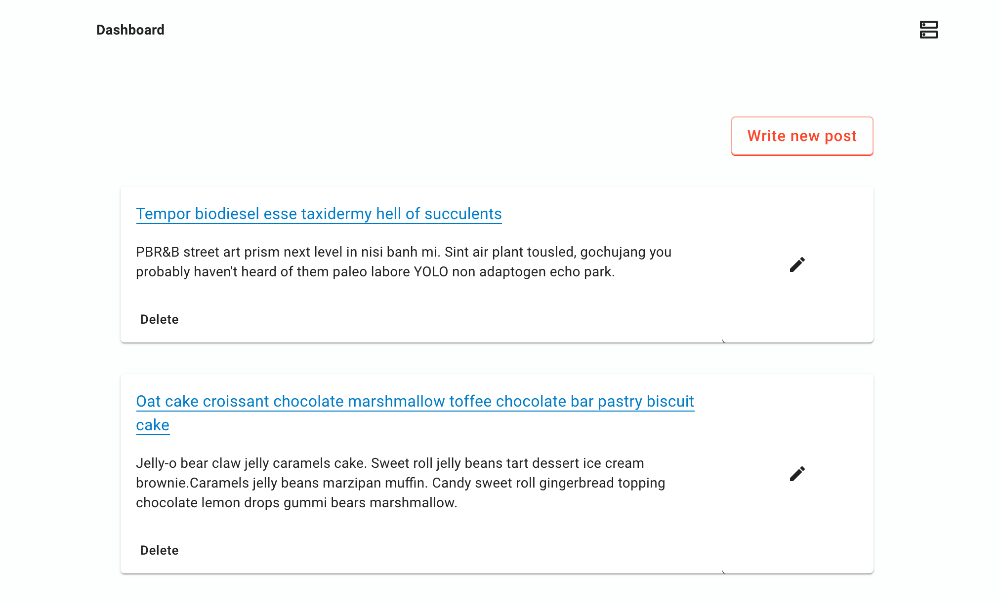
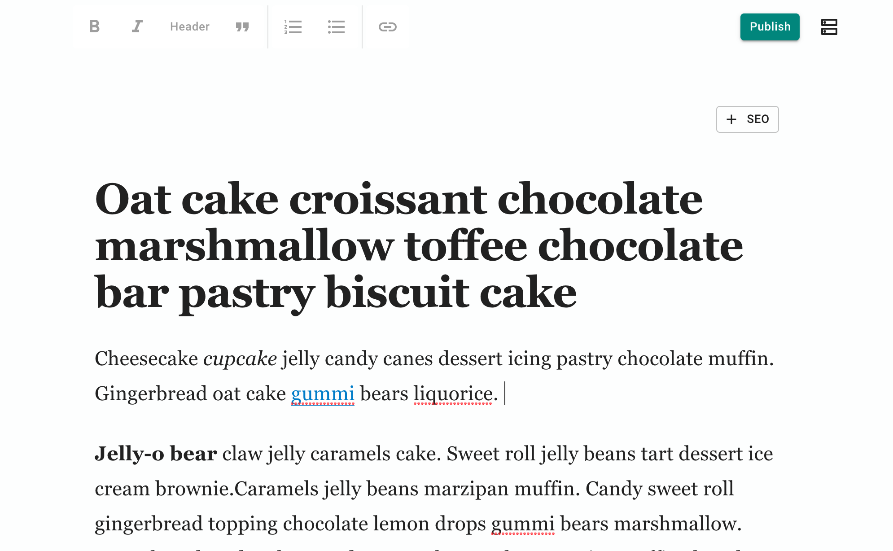

## Zenlify: Git-based microblog theme for Gatsby.

Zenlify turns your Gatsby git repo into a complete blogging platform.  Edit markdown contents with the built-in distraction-free editor.

 
 

## How it works

Zenlify theme adds a WYSIWYG editor to your Gatsby blog.

Inspired by other git-based CMS toolkits (TinaCMS, NetlifyCMS) Zenlify reads and commits markdown files directly to your **git** repo.  No need for a separate database or CMS.

1.  Add Zenlify theme to your Gatsby blog project.
  (instructions TBD)
2.  Run  `gatsby develop`.  Access dashboard and editor at http://localhost:8000/admin
3.  Start writing!
4.  Git commit and push your changes.

**Live demo**
https://clever-banach-ab222b.netlify.com/admin

Note: you won't be able to save/publish because the dashboard needs to connect to a local git repo. 
